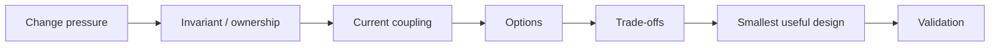

# 16 — Senior Practice: Design Judgment Under Constraints

This section tests whether you can apply principles without turning them into slogans.

For every case:

1. identify the real change pressure;
2. name the invariant or contract that must survive;
3. map coupling and ownership;
4. state which principles pull in different directions;
5. choose the simplest design that protects the important constraint;
6. explain what would make you reconsider.

## Decision loop

## Cases

1. [Refactor an Overloaded Service](01-large-service-refactor.md)
2. [Choose the Right Abstraction](02-abstraction-decision.md)
3. [Design Error Boundaries](03-error-boundary-design.md)
4. [Dependencies & Testability](04-dependency-testability.md)
5. [Maintainability Review](05-maintainability-review.md)
6. [Principle Conflicts](06-principle-conflicts.md)

Then use:
- [Trade-off Matrices](TRADE-OFF-MATRICES.md)
- [Senior Interview Drills](INTERVIEW-DRILLS.md)
- [GRASP Responsibility Crosswalk](GRASP-CROSSWALK.md)
- [Runnable Java/Spring Checkout Refactoring Lab](labs/checkout-refactoring/README.md)

## Senior standard

A strong answer:
- describes consequences instead of citing SOLID/DRY/KISS by name only;
- distinguishes business boundaries from framework layers;
- removes unnecessary abstraction as readily as it adds useful abstraction;
- keeps error semantics explicit;
- treats tests as protection of behavior, not implementation structure;
- accounts for team comprehension, operability, and deletion cost;
- states the accepted downside of the chosen design.

## Connections

Use [Senior Synthesis](../15-senior-synthesis/README.md) before these cases. Move to [Software Architecture](https://github.com/YosrBennagra/software-architecture) when the decision concerns system topology or architecture style.
