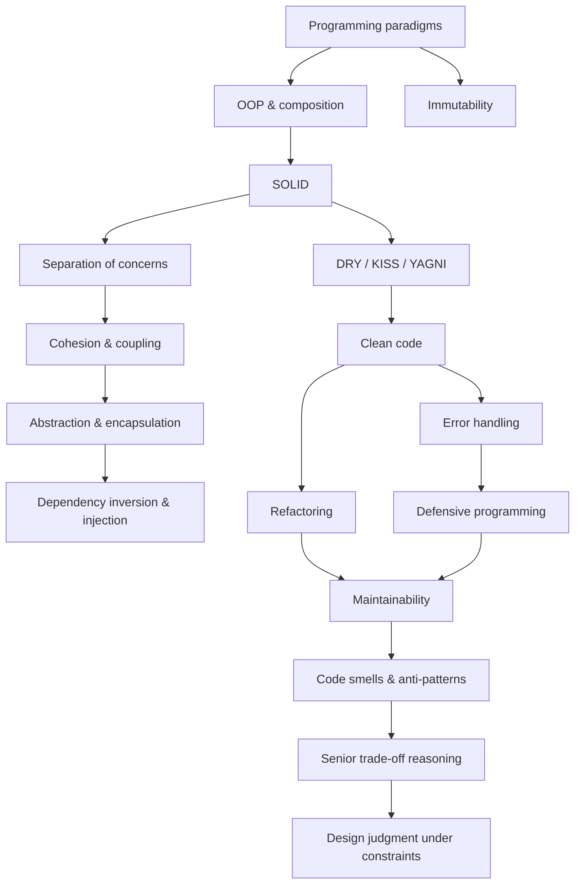

# Programming Principles

A practical **0 → expert** guide to the principles that make software understandable, changeable, testable, and safe to evolve.

This repository is part of the interconnected knowledge system:
- [Software Engineer Roadmap](https://github.com/YosrBennagra/software-engineer-roadmap) — master learning order.
- [Computer Science Fundamentals](https://github.com/YosrBennagra/computer-science-fundamentals) — underlying CS concepts.
- [Software Architecture](https://github.com/YosrBennagra/software-architecture) — architecture and system-level decisions.

Detailed design patterns belong in [design-patterns](https://github.com/YosrBennagra/design-patterns), while architecture material belongs in [software-architecture](https://github.com/YosrBennagra/software-architecture). This repository focuses on **principles for writing and evolving code**.

## How to use this repository

Every major topic uses the same format:

1. **Wall Note / A4** — a short memory trigger.
2. **Detailed Notes** — what, why, how, examples, trade-offs, mistakes, and senior-level understanding.
3. **Questions / Exercises** — revision and interview practice.
4. **Connections** — prerequisites, related topics, and links to specialized repositories.

The goal is not to apply every rule mechanically. The goal is to understand the forces behind the rule and know when a trade-off justifies breaking it.

After the parent topics, use the focused [Deep Dives](DEEP-DIVES.md). After that, use [Senior Practice](16-senior-practice/README.md) to make design decisions under conflicting constraints instead of merely reciting principles.

## Learning order

- [ ] 00. [Programming Paradigms](00-paradigms/README.md)
- [ ] 01. [OOP & Composition](01-oop-composition/README.md)
- [ ] 02. [SOLID](02-solid/README.md)
- [ ] 03. [DRY, KISS & YAGNI](03-simplicity/README.md)
- [ ] 04. [Separation of Concerns](04-separation-of-concerns/README.md)
- [ ] 05. [Cohesion & Coupling](05-cohesion-coupling/README.md)
- [ ] 06. [Abstraction & Encapsulation](06-abstraction-encapsulation/README.md)
- [ ] 07. [Immutability](07-immutability/README.md)
- [ ] 08. [Dependency Inversion & Dependency Injection](08-dependencies/README.md)
- [ ] 09. [Clean Code](09-clean-code/README.md)
- [ ] 10. [Error Handling](10-error-handling/README.md)
- [ ] 11. [Refactoring](11-refactoring/README.md)
- [ ] 12. [Defensive Programming](12-defensive-programming/README.md)
- [ ] 13. [Maintainability](13-maintainability/README.md)
- [ ] 14. [Code Smells & Anti-Patterns](14-code-smells/README.md)
- [ ] Strengthen the core areas with [Deep Dives](DEEP-DIVES.md)
- [ ] 15. [Senior Synthesis: Principles as Trade-offs](15-senior-synthesis/README.md)
- [ ] 16. [Senior Practice: Design Judgment Under Constraints](16-senior-practice/README.md)

## Topic map

## What “expert” means here

An expert does not quote principles as slogans. They can:
- explain which design force a principle addresses;
- recognize when principles conflict;
- prefer simple, explicit designs over ceremonial abstractions;
- refactor safely using tests and small steps;
- reason about change cost, dependency direction, ownership, failure behavior, and team comprehension;
- distinguish necessary duplication from accidental duplication;
- detect smells without blindly applying patterns;
- defend a design by naming both its benefit and its accepted downside.

## Scope boundaries

Use [software-architecture](https://github.com/YosrBennagra/software-architecture) for architecture styles, DDD, microservices, distributed architecture, and system-level patterns. Use the master [software-engineer-roadmap](https://github.com/YosrBennagra/software-engineer-roadmap) to reach language/framework, testing, security, database, DevOps, and design-pattern repositories.

## Study rule

For every principle ask:

- **What problem does it prevent?**
- **What does misuse look like?**
- **What trade-off can justify violating it?**
- **Can I demonstrate it with a before/after code example?**

For senior practice add:

- **What constraints make this choice appropriate?**
- **What downside am I deliberately accepting?**
- **What future signal would make me redesign it?**

A senior engineer applies principles with judgment, not ritual.
